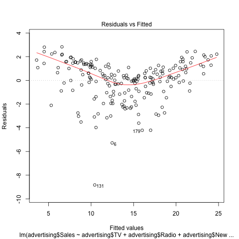

```{r, echo=FALSE}
library(xtable)
options(xtable.comment = FALSE)
```

# Abstract
The purpose of this assignment is to extend the scope of the previous HW. Not only we will look into relationships among variables, but also we will write funtions to compute some important statistics. In addition, we need to write unit tests to test our written functions. 

# Introduction
The overall goal is to examine the effect of TV, Newspaper and Radio advertising budgets on Sales by calculations and plotting graphs. If we do find a relationship, then we want to build a good linear model that can be used for Sales prediction based on TV, Newspaper or Radio advertising budgets.

# Data
The [advertising dataset](http://www-bcf.usc.edu/%7Egareth/ISL/Advertising.csv) consists of Sales(in thousands of units) of a particular product in 200 different markets, along with advertising budgets (in thousands of dollars) for the product in each of those markets for three different media (TV, Newspaper and Radio). 

# Methodology
We consider Sales vs TV, Newspaper and Radio advertising budgets in our dataset and try to fit them in a multiple linear regression model:

\begin{center} $Sales = \beta_0 + \beta_1TV + \beta_2Newspaper + \beta_3Radio$ \end{center}

In order to estimate four coefficients $\beta_0$, $\beta_1$, $\beta_2$ and $\beta_3$ we fit the linear regression model via the least square criterion.

# Results
## Simple linear regression
```{r, echo=FALSE}
load('../data/regression.RData')
load('../data/correlation-matrix.RData')
source('../code/functions/regression-functions.R')
```

Before analysis about multiple linear regression, it's good to examine the relationships between Sales and each of TV, Newspaper and Radio advertising budgets.

```{r, results='asis', echo=FALSE}
table1 <- xtable(reg_Sales_on_TV, caption = "Regressing Sales on TV advertising budgets")
print(table1, comment = FALSE)
```

As we can see, the p-value of predictor is pretty small, which is `r b <- summary(reg_Sales_on_TV); round(b$coefficients['TV', 'Pr(>|t|)'], 4)`. So we can infer that there is an association between the predictor(TV advertising budgets) and the response(Sales).

```{r, results='asis', echo=FALSE}
table2 <- xtable(reg_Sales_on_Newspaper, caption = "Regressing Sales on Newspaper advertising budgets")
print(table2, comment = FALSE)
```

As we can see, the p-value of predictor is pretty small, which is `r b <- summary(reg_Sales_on_Newspaper); round(b$coefficients['Newspaper', 'Pr(>|t|)'], 4)`. So we can infer that there is an association between the predictor(Newspaper advertising budgets) and the response(Sales).

```{r, results='asis', echo=FALSE}
table3 <- xtable(reg_Sales_on_Radio, caption = "Regressing Sales on Radio advertising budgets")
print(table3, comment = FALSE)
```

As we can see, the p-value of predictor is pretty small, which is `r b <- summary(reg_Sales_on_Radio); round(b$coefficients['Radio', 'Pr(>|t|)'], 4)`. So we can infer that there is an association between the predictor(Radio advertising budgets) and the response(Sales).

According to simple linear regression, Sales has a linear relationship with each of TV, Newspaper or Radio advertising budgets independently

# Multiple linear regression
Now, let's do some multiple linear regression analysis .

First, we should examine least squares coefficient estimates.
```{r, results='asis', echo=FALSE}
table4 <- xtable(multi_reg_sum, caption = "Coefficient estimats of the least squares model")
print(table4)
```

As we can see, the coefficient estimate for **Newspaper** in the multiple regression model is close to zero, and the corresponding p-value is no longer significant, which is `r round(multi_reg_sum$coefficients['Newspaper', 'Pr(>|t|)'], 2) `. This is different from the result of simple linear regression. 

In fact, it makes sense that multiple regression suggest no relationship between **Sales** and **Newspaper** while the simple linear regression implies the opposite. 

```{r, results='asis', echo=FALSE}
table5 <- xtable(matrix_cor, caption = "Correlation matrix")
print(table5)
```

\newpage
By **Table 5**, the correlation between **radio** and **newspaper** is `r round(matrix_cor['Radio', 'Newspaper'],2)`. This reveals a tendency to spend more on newspaper advertising in markets where more is spent on radio advertising. In a simple linear regression which only examines **Sales** versus **Newspaper**, we observe that higher values of **Newspaper** tend to be associated with higher values of **Sales**, which is because **Newspaper** is a surrogate for **Radio** advertising; **Newspaper** gets "credit" for the effect of **Radio** on **Sales**.


Now, let's answer following questions. 

## Is at least one of the predictors useful in predicting the response?
```{r, results='asis', echo=FALSE}
stats_df <- data.frame(
  Quantity = c("Residual standard error", "R squared", "F-statistic"),
  Value = c(residual_std_error(multi_reg), r_squared(multi_reg), f_statistic(multi_reg))
)
print(xtable(stats_df, caption = "RSE, R-squared and F-statistic of the least squares model"))

```
By **Table 6**, the F-statistic for the multiple linear regression model obtained by regressing **Sales** onto **TV**, **Newspaper**, **Radio** is `r round(stats_df[3,2],2)`. Since this is far larger than 1, it suggests that at least one of the advertising media must be related to **Sales**.

## Do all predictors help to explain the response, or is only a subset of the predictors useful?

As we discussed before, if the significance level is 0.05, the p-value of **Newspaper** is **Table4** is larger than our significance level. So only a subset of the predictors (**TV** and **Radio**) are useful.

## How well does the model fit the data?
Two of the most common numerical measures of model fit are the RSE and R-squared. As we can see, in **Table 6**, the R-squared is `r round(stats_df[2,2],2)`, which is very close to 1. So the model explains a large portion of the variance in the response variable and fits well.

The RSE is `r round(stats_df[1,2],2)`, which is less than the RSE of model that contains only **TV**, `r round(residual_std_error(reg_Sales_on_TV),2)`. This corroborates our previous conclusion that a model uses TV and Radio advertising budgets to predict Sales is much more accurate.

## How accurate is the prediction?


\newpage
According to residual plot, we can say that our prediction is pretty accurate when the expenditure of TV, Newspaper and Radio is between 10 thousands of dollars and 20 thousands of dollars. But it becomes less accurate when the expenditure is below 10 thousands of dollars or above 20 thousands of dollars.

# Conclusion
Through comparison between simple linear regression and multiple linear regression, we find that they may lead to different conclusions. With correlation of **Newspaper** and **Radio**, we can conclude that Newspaper does not help predicting Sales. Also, by examing R-squared and RSE, we are confident that our model fits pretty well. At last, we make a estimation that our model is accurate when the expenditure is between 10 thousands of dollars and 20 thousands of dollars. 
